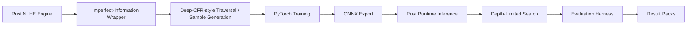

# Talibus

**Research prototype for 6-max No-Limit Texas Hold'em AI systems and
imperfect-information game evaluation.**

Talibus explores how to build an imperfect-information game AI system around a
Rust poker simulation/runtime stack, a Deep-CFR-style training pipeline,
PyTorch models, ONNX deployment, scripted opponent evaluation, and
depth-limited search.

It is intended as a systems and AI research project around poker-like decision
problems, not as a real-money poker bot, live-play assistant, overlay, casino
automation tool, or platform-rule bypass tool. It does not claim solved poker,
superhuman play, production readiness, real-world profitability, or proven
multiplayer Deep CFR convergence.

## Plain-English Summary

Poker is an imperfect-information game: the agent must make decisions while
hidden information remains unresolved, including opponents' private cards and
future actions. Talibus explores how an engine, training pipeline, model
deployment path, search layer, and evaluation harness can be built around that
kind of decision problem.

## Status

This is a public research snapshot. Documentation, result-pack interpretation,
responsible-use framing, compact result evidence, and trained ONNX model
artefacts are available. Large generated buffers, raw logs, and PyTorch
checkpoints are excluded because they are generated artefacts.

The repository includes the released Talibus 6-max long-run ONNX models under
`artifacts/models/talibus-6max-longrun-opt-v1/`, together with model
specifications, SHA-256 hashes, and usage instructions.

The repository is reviewable and buildable in parts. Full long-run reproduction
requires generated training data, configured dependencies, and substantial
compute.

## Trained Model Release

The public model release is:

`artifacts/models/talibus-6max-longrun-opt-v1/`

It contains:

- `strategy_shared_best_ring.onnx`: the default released strategy model used
  for the published mixed-table evaluation.
- `advantage_shared_best_ring.onnx`: the paired advantage model from the same
  best-ring promotion snapshot.
- `model_spec.json`: machine-readable model, abstraction, training, ONNX, and
  evaluation metadata.
- `SHA256SUMS`: checksums for the ONNX artefacts.

The trained model should be interpreted as research-prototype evidence and
reproducibility support, not as a production poker bot or claim of real-world
poker strength.

## Published Controlled Benchmark

The released strategy model is tied to the compact result pack at
`results/2026-04-03-6max-longrun-opt/`.

In that controlled simulator benchmark, Talibus was evaluated across all six
seats in 1,000-hand mixed-table runs with a 2,000 ms depth-limited-search
budget, 200 deck samples, and scripted opponents in the order TAG, calling
station, LAG, nit, TAG. Within that setup, the seat results ranged from
3664.615 to 6222.160 bb/100, averaging 5008.903 bb/100.

Those are strong results for this scripted simulator setting, but they are not
evidence of real-money profitability, human-level strength, commercial solver
quality, or superhuman play.

## Technical Summary

Talibus combines Rust and Python components:

- a Rust 6-max NLHE simulation/runtime stack,
- imperfect-information state wrappers and fixed action abstraction,
- Deep-CFR-style traversal and sample generation,
- PyTorch training for neural strategy components,
- ONNX export for Rust-side model inference,
- depth-limited runtime search over a neural policy,
- controlled simulator evaluation against scripted baselines,
- compact public result packs for reproducibility review.

## What This Demonstrates

- Rust simulation/runtime engineering.
- Python/PyTorch ML training pipeline work.
- ONNX model deployment into a Rust runtime.
- Imperfect-information game abstraction.
- Evaluation harness design for controlled simulator experiments.
- Responsible claim framing for AI/game research artifacts.

## Highlights

- Rust NLHE game mechanics, betting, pots, showdown, and legal-action handling.
- Imperfect-information wrappers and fixed action-slot abstraction.
- Deep-CFR-style traversal and sample generation.
- Reservoir and disk-backed training buffers.
- Scripted TAG, LAG, nit, and calling-station baseline policies.
- Model-only ring-game evaluation.
- Depth-limited search experiments over a neural policy.
- Evaluation harnesses for seat rotation, checkpoint progression, opponent
  comparison, mixed tables, and search-budget sweeps.
- Compact public result packs under `results/`.

## Architecture At A Glance



## Documentation

- [Architecture](docs/architecture.md): component map and runtime/training flow.
- [Project Walkthrough](docs/project-walkthrough.md): reader-friendly overview
  of the system, evaluation framing, reproducibility boundaries, and
  responsible-use context.
- [Setup](docs/setup.md): installation, checks, and common commands.
- [Model Release](docs/model_release.md): released ONNX artefacts, tensor
  shapes, hashes, usage commands, and metric interpretation.
- [Evaluation](docs/evaluation.md): evaluation harnesses and published result
  pack interpretation.
- [Limitations](docs/limitations.md): scope, caveats, and claims this project
  does not make.
- [Responsible Use](docs/responsible-use.md): intended and prohibited uses.
- [v0.1 Release Notes](docs/release-notes-v0.1.md): public release summary for
  the first research snapshot.
- [Roadmap](ROADMAP.md): conservative next steps.

## Repository Layout

```text
checkpoints/nlhe_clusters/     Precomputed abstraction cluster assets
docs/                          Architecture, setup, evaluation, limitations, and release notes
eval/                          Python evaluation helpers and regression tests
results/                       Compact public result packs
solver/                        Rust workspace for game, CFR, and runtime code
training/deep_cfr/             PyTorch training and long-run orchestration
run_eval_suite.py              Structured 6-max evaluation runner
deep_cfr_watchdog.ps1          Windows helper for long training runs
```

Large generated buffers, raw logs, PyTorch checkpoints, and ONNX model binaries
outside the published model package are not committed directly to Git. The
included result pack records model metadata and SHA-256 hashes for the
artefacts used to produce the published evaluation.

## Quick Start

Install Rust stable, Python 3.10 or newer, and a native build toolchain. Then:

```bash
python3 -m venv .venv
source .venv/bin/activate
pip install --upgrade pip
pip install -r training/deep_cfr/requirements.txt
pip install -r eval/requirements.txt
```

On Windows PowerShell:

```powershell
py -3 -m venv .venv
.\.venv\Scripts\Activate.ps1
python -m pip install --upgrade pip
python -m pip install -r training\deep_cfr\requirements.txt
python -m pip install -r eval\requirements.txt
```

Build and test the Rust workspace:

```bash
cd solver
cargo check --workspace
cargo test -p cfr
cargo test -p abstraction
cargo build --release -p deep_cfr --bin ring_game_eval --bin realtime_play
```

Run Python checks from the repository root:

```bash
python -m compileall -q .
python -m unittest discover eval
python run_eval_suite.py --help
```

See `docs/setup.md` for platform notes, ONNX Runtime details, and the longer
verification checklist.

## Quick Verification / Smoke Checks

The repository includes a trained ONNX strategy model, so users can run a
small scripted-opponent smoke evaluation after building the Rust runtime
binaries. Full long-run reproduction still requires generated training data and
substantial compute.

The lightweight source checks below verify that the Python modules parse, the
evaluation CLIs are discoverable, and the fast evaluation tests pass.

After installing the Python requirements, run from the repository root:

```bash
python3 -m py_compile \
  training/deep_cfr/model.py \
  training/deep_cfr/train.py \
  training/deep_cfr/reservoir.py \
  training/deep_cfr/run_deep_cfr.py \
  run_eval_suite.py

python3 run_eval_suite.py --help
python3 -m eval.run_league --help
python3 -m unittest discover eval
```

On systems where `python` points to Python 3, use `python` instead of
`python3`. These commands do not start long training jobs, do not require a
trained ONNX model, and do not generate large artifacts.

After building the Rust binaries, a short trained-model smoke run can be
started from the repository root:

```bash
solver/target/release/ring_game_eval \
  --model artifacts/models/talibus-6max-longrun-opt-v1/strategy_shared_best_ring.onnx \
  --policy strategy \
  --cluster-dir checkpoints/nlhe_clusters \
  --num-players 6 \
  --hands 100 \
  --opponent tag
```

## Training

The main training entry point is:

```bash
python training/deep_cfr/run_deep_cfr.py --help
```

A full 6-max run requires the Rust traversal binary, abstraction clusters, and
substantial generated data under `data/`. Start with small smoke settings before
launching long runs. Long-run artifacts can be many gigabytes and are excluded
by `.gitignore`.

## Evaluation

The main structured evaluation entry point is:

```bash
python run_eval_suite.py --help
```

The suite expects compiled Rust binaries and a trained ONNX strategy model.
Evaluation outputs are controlled simulator measurements against scripted
baselines. They are useful for regression testing and research comparison, but
they are not evidence of real-money performance, human-level strength, or
solver-level strength.

Included public result pack:

- `results/2026-04-03-6max-longrun-opt/`

That pack contains a sanitized summary of a 6-max mixed-table simulator
evaluation using the released `strategy_shared_best_ring.onnx` artifact. The six
seat-rotation runs used 1,000 hands per seat, a 2,000 ms search budget, 200 deck
samples, and scripted mixed opponents: TAG, calling station, LAG, nit, TAG.

**Result interpretation warning:** the reported seat bb/100 values are
controlled simulator measurements against scripted baseline opponents. They are
useful for regression and evaluation inside this codebase only. They are not
evidence of real-money performance, human-level play, solver-level play, or
general poker strength.

Within that limited setup, the reported seat bb/100 values range from 3664.615
to 6222.160, averaging 5008.903 bb/100 across seats.

See `docs/evaluation.md` for result-file meanings and interpretation guidance.

## Additional Notes

`training/deep_cfr/REMOTE_WINDOWS_RUNBOOK.md` contains a generalized remote
Windows training workflow for larger experiments.

## License

This project is released under the MIT License. See `LICENSE`.
