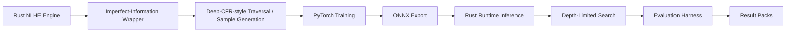

# Project Walkthrough

## What Talibus Is

Talibus is a research and systems prototype for imperfect-information game AI
around 6-max No-Limit Texas Hold'em. It combines a Rust poker
simulation/runtime stack with a Deep-CFR-style training pipeline, PyTorch model
training, ONNX deployment, scripted opponent evaluation, and depth-limited
search experiments.

The project is best read as an AI systems and evaluation harness project: how
to represent game state, generate training samples, train models, deploy them
into a Rust runtime, and measure behavior in a controlled simulator.

## What Talibus Is Not

Talibus is not a real-money poker bot. It is not a live decision-support tool,
RTA, overlay, casino automation tool, poker-site automation tool, or
platform-rule bypass tool.

It does not claim solved poker, superhuman play, real-world profitability,
human-level strength, solver-level strength, or proven multiplayer Deep CFR
convergence.

## Why Poker Is An Imperfect-Information Game

Poker is useful as a research setting because decisions are made under
incomplete information. A player cannot see opponents' private cards, does not
know future board cards, and cannot know future opponent actions. The agent has
to reason from public actions, private cards, board state, stack/pot context,
and uncertainty.

That makes poker a natural environment for studying abstraction, simulation,
search, model deployment, and evaluation design. Talibus focuses on those
systems questions rather than claiming practical poker strength.

## High-Level Architecture

The pipeline is:

1. Rust NLHE engine.
2. Imperfect-information wrapper.
3. Deep-CFR-style traversal / sample generation.
4. PyTorch training.
5. ONNX export.
6. Rust runtime inference.
7. Depth-limited search.
8. Evaluation harness.
9. Result packs.

Future improvement: add a static architecture image or GIF for easier sharing
outside GitHub.

## Rust Components

The Rust workspace under `solver/` contains the game and runtime side of the
project.

- `solver/game` implements NLHE mechanics such as seats, blinds, betting
  rounds, stacks, pots, board cards, terminal states, and showdown.
- `solver/cfr/src/nlhe_game.rs` wraps the game as an imperfect-information
  model and builds information sets from public and private game context.
- The action space is abstracted into fixed policy slots for fold/check/call,
  bet/raise sizes, and all-in actions.
- `solver/deep_cfr` contains traversal, feature encoding, ONNX policy loading,
  runtime inference, depth-limited search, and evaluation/runtime binaries.

The public-facing binaries include model-only ring evaluation and
depth-limited-search evaluation/experimentation modes.

## Python / PyTorch Components

The Python stack under `training/deep_cfr/` handles the training side:

- loading traversal samples,
- training PyTorch models,
- managing in-memory and disk-backed sample buffers,
- exporting model artifacts,
- orchestrating longer traversal/training/evaluation workflows.

The repository includes orchestration scripts and public result-pack metadata.
Large generated buffers and checkpoints are not tracked directly in Git.

## ONNX Deployment Path

Talibus trains models in Python/PyTorch and exports them to ONNX so the Rust
runtime can load models for inference, evaluation, and depth-limited search
experiments without keeping Python in the decision loop.

The public result pack records ONNX artifact names, sizes, and SHA-256 hashes.
The trained ONNX artifacts, model specifications, and evaluation/performance
metrics are scheduled for public release on Tuesday 26 May 2026 as separately
managed release artifacts rather than normal source commits.

## Evaluation Approach

Talibus uses controlled simulator evaluation, not real-money play. The
evaluation suite is designed for regression and research comparison inside this
codebase.

The supported evaluation patterns include:

- scripted baselines,
- seat rotation,
- search-budget sweeps,
- checkpoint progression,
- model-only policy evaluation,
- mixed-table evaluation,
- compact result packs.

Scripted baselines are useful for repeatable engineering tests, but they are
not a substitute for solver-level analysis or real-world strength claims.

## How To Interpret The Result Numbers

The published bb/100 numbers are controlled simulator measurements against
scripted opponents. They are useful for regression/evaluation inside this
codebase only.

They are not evidence of real-money performance, human-level play, solver-level
play, or general poker strength. High values may reflect scripted baseline
weakness, simulator assumptions, search settings, and the specific evaluation
setup.

The result numbers are kept in the repository because they document one
recorded controlled run and provide a regression reference. They should not be
read as a poker-strength benchmark.

## What The Public Repo Can Reproduce

The public repository supports lightweight verification and documentation
review:

- Python compile checks for selected training/evaluation modules.
- Evaluation CLI help commands.
- Unit tests under `eval/`.
- Rust cargo checks/tests if the Rust toolchain and dependencies are available.
- Inspection of docs and compact result-pack metadata.

See [setup.md](setup.md) for the exact smoke-check commands.

## What The Public Repo Cannot Fully Reproduce Yet

The public repository cannot fully reproduce the recorded long run end to end
from the source tree alone without additional local/generated artifacts.

Not fully reproducible from the public checkout alone:

- full long-run training,
- exact ONNX model inference from the recorded result pack until the scheduled
  model artifacts are published,
- full result-pack generation.

The reasons are practical: large generated buffers, raw logs, PyTorch
checkpoints, ONNX model binaries, and some long-run artifacts are managed
outside normal Git commits. Full reproduction also needs configured
dependencies, abstraction assets, local generated data, and substantial compute.

## Why Large Artifacts Are Not Committed

Training buffers, raw logs, checkpoints, and model binaries can be large and
are generated artifacts rather than source. The public result pack includes
compact summaries, configuration notes, environment notes, and model artifact
hashes.

The trained ONNX artifacts, model specifications, and evaluation/performance
metrics are scheduled for public release on Tuesday 26 May 2026 as a separate
artifact package. The expected release package should include exported ONNX
artifacts, model/specification metadata, checksums, evaluation metrics against
scripted opponent profiles, and instructions for loading/running the released
model.

Future work may improve packaging and reproducibility with smaller demo configs,
validation scripts, and better artifact publication.

## Responsible Use

See [responsible-use.md](responsible-use.md). Talibus is intended for research,
education, simulation, and software engineering review. It should not be used
for real-money play, live decision support, platform automation, or bypassing
platform rules.

## Where To Start As A Reader

1. [README.md](../README.md)
2. [docs/project-walkthrough.md](project-walkthrough.md)
3. [docs/architecture.md](architecture.md)
4. [docs/evaluation.md](evaluation.md)
5. [docs/limitations.md](limitations.md)
6. [docs/responsible-use.md](responsible-use.md)
